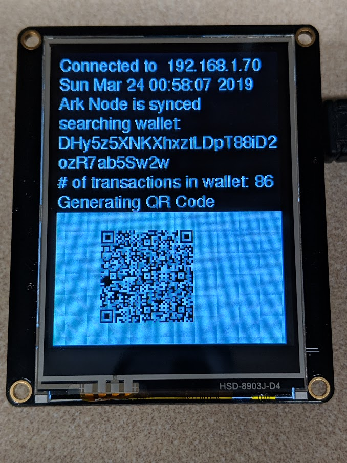

# Ark_IOT_BasicDemo1

Example Project -work in progress.  

This example illustrates a demo of basic operation of the ARK client interface. This was created as way for me to learn the Ark API 

Program Features: 
This program has been tested with ESP32 Adafruit Huzzah however it should also work with ESP8266 modules with minor changes to hardware connections and wifi libraries.
This sketch will use the ARK Cpp-Client API to interact with an Ark V2 Devnet node.
Ark Cpp Client available from Ark Ecosystem <info@ark.io>
Ark API documentation:  https://docs.ark.io/sdk/clients/usage.html

Electronic Hardware Peripherals:
	Adafruit TFT FeatherWing 2.4" 320x240 Touchscreen
    
    

    
    
